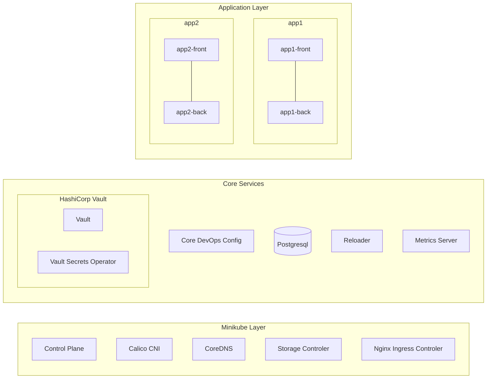
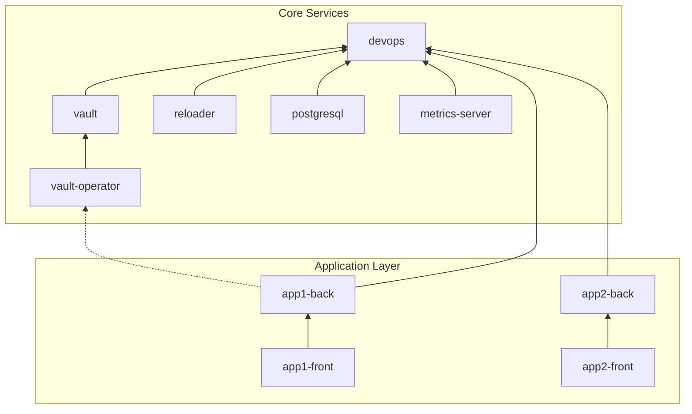

# K8s Deployment (Example)

<a name="table-of-content"></a>
Table of Content:
- [Introduction](#introduction)
- [Local Development Environment](#local-development-environment)
- [Project Structure](#project-structure)
- [Deployment Process and Toolset](#deployment-process-and-toolset)
   * [Deployment Verification](#deployment-verification)
- [Build and Using Local Environment](#build-and-using-local-environment)
- [Helmfile Reasoning](#helmfile-reasoning)
- [Architecture](#architecture)
   * [Service Layer Breakdown](#service-layer-breakdown)
- [Secrets Management](#secrets-management)
   * [SOPS](#sops)
   * [HashiCorp Vault](#hashicorp-vault-solution)
- [Application Stack ](#application-stack)
   * [External Services](#external-services)
      + [Metrics Server](#metrics-server)
      + [HashiCorp Vault](#hashicorp-vault)
      + [Reloader](#reloader)
      + [PostgreSQL](#postgresql)
   * [In-House Services](#in-house-services)
      + [DevOps](#devops)
      + [Backend](#backend)
      + [Frontend](#frontend)

## Introduction

This project demonstrate the deployment of a simple frontend-backend application in Kubernetes.

The objectives of this project are to:

- Showcase how to use a local Kubernetes environment for development and testing.
- Introduce tools for deploying a full-stack application and its dependent services to Kubernetes.
- Explore different approaches to managing secrets in a Kubernetes environment.
- Enhance network security by implementing **Network Policies**

[Back to Table of Content](#table-of-content)

## Local Development Environment

A fast and easily configurable local environment is crucial for implementing a rapid development
process with a quick feedback loop. My current setup is based on [Minikube](https://minikube.sigs.k8s.io/) 
using the [Docker driver](https://minikube.sigs.k8s.io/docs/drivers/docker). This approach allows for easy
testing of different configurations, even when working on multiple projects, thanks to **Minikube
profiles**.

To monitor the state of the Kubernetes cluster, I use [k9s](https://k9scli.io/), which provides 
a user-friendly terminal UI. For scripting and automation tasks, I primarily use 
[kubectl](https://kubernetes.io/docs/reference/kubectl/).

For task automation, I use [just](https://just.systems/). Initially, I used [GNU Make](https://www.gnu.org/software/make/),
but it has its own quirks. *just* aiiows me to create a consistent CLI interface that streamlines interactions
with all project-related tools.

The full list of available commands can be accessed by running:
```sh
    $ just
```
All further command examples will include both the *just* version and the original command. The command
definitions can be found in the [justfile](justfile).

List of tools *(The versions in bracklets indicate the ones used by me during development)*:

- docker engine (v27.3.0)
- minikube (v1.34.0) with Kubernetes (v1.31.0)
- kubectl (v1.31.2) 
- just (1.37.0)
- k9s (0.32.6)

[Back to Table of Content](#table-of-content)

## Project Structure

```
|-- charts
|   |-- backend
|   |-- devops
|   `-- frontend
|-- docker
|   `-- backend-verification
|-- environments
|   |-- development
|   |   `-- secrets
|   `-- common.yaml
|-- sops
|-- vault
|-- .sops.yaml
|-- helmfile.yaml
|-- justfile
```

Explanation:

- *charts/* – Contains custom Helm charts for:
  * DevOps configuration
  * Frontend application
  * Backend application
- *docker/backend-verification/* – Includes all files needed to build an image for verifying whether the backend service is functioning correctly.
- *environments/* – Stores environment-specific variables and secrets used as input for Helm releases.
  * *development/secrets/* – Secrets specific to the development environment.
  * *common.yaml* – Shared configuration across environments.
- *sops/* – Contains GPG keys.
- *vault/* – Contains the initial configuration for HashiCorp Vault, used in the `just init-vault` task.
- *.sops.yaml* – Configuration file for SOPS (Secrets OPerationS).
- *helmfile.yaml* – The main configuration file for Helmfile, defining how Helm releases are managed.
- *justfile* – Contains just task definitions for automating common project tasks.

[Back to Table of Content](#table-of-content)

## Deployment Process and Toolset

To configure the cluster and deploy all necessary applications, I chose a **push-based approach**. 
This method is easier and faster to run locally, as it doesn't require additional services like 
[ArgoCD](https://argo-cd.readthedocs.io/) or [FluxCD](https://fluxcd.io/) within Kubernetes.

Two main tools in this process are (Helm)[https://helm.sh/] to manage installation of separate application and
[Helmfile](https://helmfile.readthedocs.io/) to manage full stack and environments. I could use Helm alone 
but *Helmfile* allows me to better manage variables (per environment), secrets and installing/updating not 
only full stack but some part's of it. More info about it will be in section [Application Stack](#application-stack)


The two main tools in this process are:

- [Helm](https://helm.sh/) – Manages the installation of individual applications.
- [Helmfile](https://helmfile.readthedocs.io/) – Manages the entire stack and different environments.

While I could use Helm alone, Helmfile provides better control over environment-specific 
variables, secrets, and selective stack deployments (not just full-stack updates). More 
details can be found in the [Application Stack](#application-stack) section.

For secrets manament, I'm using:

- [SOPS](https://github.com/getsops/sops)
- [The GNU Privacy Guard](https://www.gnupg.org/)

More details on secrets management are covered in the [Secrets Management](#secrets-management) section.

List of tools *(The versions in bracklets indicate the ones used by me during development)*:

- helmfile (v0.169.0)
- helm (v3.16.3)
- helm plugins:
  * diff (3.9.13)
  * secrets (4.6.0)
- GnuPG (2.4.5)

### Deployment Verification

To verify whether deployments have been successfully completed, I use a combination of built-in Helm mechanisms and Kubernetes configuration:

- **Helm Timeouts and Atomic Updates** – Ensures deployments are rolled back if they fail, and prevents timeouts during updates.
- **Kubernetes Rollout Policies** – Manages deployment strategies, ensuring the smooth rollout of new versions and handling failures appropriately.
- **Kubernetes Liveness and Readiness Checks** – Helps Kubernetes determine whether a service is healthy and ready to serve traffic.
- **Helm Test Feature** – Runs post-deployment tests to validate functionality. If a test fails, rollback is handled manually by the Release Manager.

More information about testing the backend release can be found in section [Application Stack -> In-House Services -> Backend](#backend)

[Back to Table of Content](#table-of-content)

## Build and Using Local Environment

Setting up the local environment involves multiple tools, making the process somewhat complex. 
I personally use [NixOS](https://nixos.org/) with [Home Manager](https://nix-community.github.io/home-manager/) to manage this toolset.
Currently, there is no Nix configuration available for this setup, but it will be added in the future:<br>
[Add Nix setup with tools for local environment](https://github.com/mandos/k8s-deployment.example/issues/1)

If you’re not using NixOS, another option is to install Minikube and Docker Engine manually and
use a pre-built image containing all necessary tools (planned feature):<br>
[Create image with full toolset](https://github.com/mandos/k8s-deployment.example/issues/2)

Once all required tools are installed, the local environment can be set up with the following steps:

1. Create a Minikube Cluster: `just create-k8s`<br>
   This creates a 3-node Kubernetes clster (v1.31.0) with Calico CNI, Nginx Ingress Controller and CSI Plugin. 
   Each node is allocated 2 CPUs and 3072 MB RAM.  
2. Initialize Helmfile: `just init-helmfile`<br> 
   Check Helmfile settings and installs neccessary Helm plugins.
3. Import GPG Keys: `just import-gpg-keys`<br> 
   One of solution I'm using for secrets management is SOPS with encription using GPG, this is why we need
   add these keys to local keyring. As side notes, these keys are from SOPS project and are used for
   functional testing.
   Sinsce *SOPS* is used for secrets management (with GPG encription), this step adds the requiered GPG keys
   to the local keyring. The provided keys are from the SOPS project and are used for functional testing.
4. Install Core Services: `just install-tier core`<br>
   Installs Kubernetes configuration and supporting services inside the cluster.
5. Configure HashiCorp Vault: `just init-vault`<br> 
   Sets up HashiCorp Vault with the required configuration for secret management.

Instead of running these commands separately, a single command can be used to execute all steps: `just create-environment`.

After setting up the environment, applications can be installed with:
```sh
  just install-app app1
  just install-app app2
  just install-tier apps
```
At this point, the local environment is fully configured and ready for use.

Shutting down the environment can be done with: `just stop-k8s`. It can be restarted later with: `just start k8s`.
Destroying local environment is done with: `just destroy-k8s`.

**Important note**: Since *HashiCorp Vault* is running in dev mode, there is no persistent storage. 
This means that every time the environment is restarted, Vault must be reconfigured using: `just init-vault`

This issue is planned to be fixed in:<br>
[Add persistance storage to Vault](https://github.com/mandos/k8s-deployment.example/issues/3)

[Back to Table of Content](#table-of-content)

## Helmfile Reasoning

This section describes the main reasoning behind choosing Helmfile as the primary tool for deploying 
the application stack. The goal was to deploy multiple Helm charts, currently nine, including 
both external and in-house charts. The applications depend on each other, require secrets management, 
and need a flexible deployment process that allows full or partial redeployment.

Using raw Helm alone comes with challenges:

- Installing all charts separately leads to dependency issues at the application level and complicates values management
- Using an umbrella chart for the full stack is not scalable, as it always deploys everything at once without an option for partial updates
- A mixed approach, some umbrella charts and some standalone, reduces some issues but does not fully eliminate them

How Helmfile solves these issues:

- **Application dependencies.** The needs key in a release allows defining dependencies between services, 
  ensuring they are installed in the correct order. For example, the frontend depends on the backend, 
  so Helmfile ensures they are deployed accordingly
- **Partial deployment.** Labels enable selective deployment of services. The configuration includes two labels
  *tier* (core and apps) and  *app* (devops, app1, app2, vault, postgresql, reloader). <br>
  This allows deploying specific apps with `just install-app app1` or entire core services with `just install-tier core`
- **Secrets management.** Helmfile seamlessly integrates with the Helm Secrets plugin
- **Environment and values management.** Values files can be structured by environments (development, staging, production), services (backend, frontend) and shared configurations (common.yaml). In this project, only the development environment is used, but the structure supports easy expansion
- **Fine-tuned release configuration.** I can customise specific releases. For example *devops*, *vault*, and *postgresql*, create their own namespaces. *postgresql* and *vault* have longer timeouts to accommodate their setup, etc.

This approach makes deployments more manageable, scalable, and flexible, ensuring efficient development and operations

[Back to Table of Content](#table-of-content)

## Architecture

The solution is built on a few key assumptions:
1. Kubernetes Cluster Provisioning - the Kubernetes cluster is not created by this solution; 
it is provided externally (in the local environment, this is handled by Minikube).
2. Preinstalled Services - some services inside the cluster are already preinstalled, including:
  * CNI Plugin – Calico
  * CSI Plugin
  * Ingress Controller – Nginx
  * CoreDNS
3. Deployment Responsibilities
  * Deployments within Kubernetes can be handled by different teams, including DevOps, Frontend, and Backend teams.
  * This setup provides only a basic structure for team-based deployments. Currently, namespaces are used to separate applications, but roles and role bindings are not yet implemented.

[Back to Table of Content](#table-of-content)

### Service Layer Breakdown

This solution consists of three layers:
- Kubernetes Control Plane & Core Services – Managed by Minikube.
- Core Configuration & Infrastructure Services – Managed by the DevOps team.
- Application Services – Managed by development teams (Frontend & Backend).



[Back to Table of Content](#table-of-content)

## Secrets Management

I implemented two different solutions for secrets management: one based on [SOPS](https://github.com/getsops/sops) and the [Helm Secrets plugin](https://github.com/jkroepke/helm-secrets), and another using [HashiCorp Vault](https://developer.hashicorp.com/vault/docs?product_intent=vault). In both solutions, I prepared Kubernetes Secrets for the Backend service with database credentials, *app1-back* uses the Vault solution, while *app2-back* uses the SOPS-based solution with secrets managed by the DevOps team.

### SOPS

SOPS (Secrets OPerationS) is a production-grade tool by Mozilla that encrypts and decrypts configuration files (YAML, JSON, ENV, INI) while preserving plaintext structures for version control.

In this approach, I use GPG keys exclusively to encrypt a YAML file with a master password. The process works as follows: the DevOps team has access to a designated GPG key, which they use to decrypt the YAML file containing the master password. This password is then used to install the PostgreSQL server and prepare the necessary secrets with database credentials for *app2-back*. The entire process is automated using a tool stack consisting of SOPS, the Helm Secrets plugin, and Helmfile. The configuration for SOPS is stored in the [.sops.yaml](.sops.yaml) file.

As a best practice, the configuration includes a secondary (backup) key, which should be securely stored in a vault-preferably 50 meters underground in a highly secure location. This backup key is intended for use only if the primary operational key is lost.

Additionally, I implemented Reloader, a complementary service that automatically reloads deployments whenever changes are made to ConfigMaps or Secrets.

This solution is straightforward and requires minimal setup. Encrypted data can be securely stored in a repository that only the DevOps team has access to, ensuring that developers do not have direct access to sensitive secrets.

### HashiCorp Vault Solution

HashiCorp Vault is a secure secrets management tool that encrypts, stores, and controls access to sensitive data through authentication, access policies, and dynamic secrets.

In this solution, I installed and configured the Vault server, then populated it with data needed by the backend service. As a complementary service, I used Vault Secrets Operator, which provides a way to create Kubernetes secrets from data stored in Vault and automatically reloads deployments when this data changes. To achieve this, Vault Secrets Operator introduces some Custom Defined Resources (CDR) that can be used in Helm charts.

In this process, the DevOps team is responsible for setting up Vault, configuring access to it, and populating it with the required data. They can also use CDR resources in their Helm charts to create the necessary secrets.

This approach is not entirely straightforward; it requires careful setup and maintenance of additional services. However, it offers greater flexibility and enables advanced capabilities, such as dynamically generated database passwords with lifecycle rules. Additionally, it provides a clearer division of responsibilities between DevOps and development teams.

As a side note, the Vault setup used in this demonstration runs in *dev mode*, meaning it is not suitable for production environments.

[Back to Table of Content](#table-of-content)

## Application Stack 

The Application Stack includes all releases managed by Helmfile (see [helmfile.yaml](helmfile.yaml)). This encompasses not only the applications that need to be deployed but also:

- Core services that these applications depend on.
- Generic Kubernetes configurations managed by the DevOps team.

This approach ensures that both application-specific and infrastructure-related components are deployed and maintained in a consistent, automated manner. To have better control, I utilize namespaces. In the current setup, this helps improve network isolation and organization within the cluster.


Dependecies between Helm releases:



- Solid lines indicate hard dependencies, meaning *helmfile* will enforce their installation order.
- Dotted lines represent soft dependencies, where the dependent service is still required, but *helmfile* doesn’t explicitly manage the relationship.

Namespaces with their purpose: 

- **core** - Contains the DevOps chart release, managing Kubernetes configuration and minor core services (e.g., reloader, metrics-server).
- **database** - PostgreSQL installation
- **vault** - Dedicated to HashiCorp Vault and HashiCorp Secrets Operator.
- **backend** - Namespace for the in-house backend applications.
- **frontend** - Namespace for the in-house frontend applications.

[Back to Table of Content](#table-of-content)

### External Services

#### Metrics Server

[Metrics Server](https://github.com/kubernetes-sigs/metrics-server) is required for Horizontal Pod Autoscaling (HPA).

#### HashiCorp Vault

As part of secrets management for **app1** application, I implemented a solution based on [HashiCorp Vault](https://developer.hashicorp.com/vault/docs?product_intent=vault). This installation is minimal, and for simplicity, I am currently using dev mode, which requires reconfiguring Vault every time the Local Dev Environment is started.

In this setup, the following Vault features are used:

- [Key/Value v2 secret engine](https://developer.hashicorp.com/vault/docs/secrets/kv/kv-v2) – Stores secrets, such as database credentials.
- [Kubernetes auth method](https://developer.hashicorp.com/vault/docs/auth/kubernetes) – Allows Kubernetes to authenticate with Vault and update secrets.
- [Transit secret engine](https://developer.hashicorp.com/vault/docs/secrets/transit)– Provides encryption for Vault Secrets Operator.

Additionally, Vault Secrets Operator is installed as a complementary service. This enables automatic updates of Kubernetes secrets and, if necessary, triggers deployment rollouts.

TODO:<br>
[Add persistance storage to Vault](https://github.com/mandos/k8s-deployment.example/issues/3)

#### Reloader

[Reloader](https://github.com/stakater/Reloader) is required as part of the SOPS-based secrets management solution for **app2**. This lightweight service automatically triggers deployment rollouts whenever *ConfigMaps* or *Secrets* change.

While I could also use Reloader for **app1**, I intentionally kept the secrets management solutions separate to maintain clear boundaries between different approaches.

#### PostgreSQL

A non-HA, basic PostgreSQL installation is used, based on the [Bitnami PostgreSQL Helm chart](https://artifacthub.io/packages/helm/bitnami/postgresql). The setup mostly relies on default values, with minimal modifications, primarily storing the master password in a SOPS-encrypted YAML file for security. 

No additional roles or databases were created; backend services use the *postgresql* user with the master password. Of course, this approach is **not acceptable** in a production environment, but it works fine for demonstration purposes.

TODO:<br>
[Hardening network policies for Postgresql](https://github.com/mandos/k8s-deployment.example/issues/5)

[Back to Table of Content](#table-of-content)

### In-House Services

All charts are created following the [YAGNI principle](https://en.wikipedia.org/wiki/You_aren't_gonna_need_it) to keep them minimal and focused.

- The DevOps chart was built from scratch.
- The Backend and Frontend charts were initially generated using helm create and then customized as needed.
- [JSONSchema validation](https://helm.sh/docs/faq/changes_since_helm2/#validating-chart-values-with-jsonschema) has not been added yet, but if the number of input values increases, it will be the preferred way to prevent common misconfigurations.

#### DevOps

This is an example of a basic configuration for a cluster where different teams can deploy and manage their own applications. Due to namespace separation, we can configure settings for different teams or application types. In the current version of the chart, I manage the following:

- **Namespaces** for the database, backend, and frontend applications.
- **Limit Ranges** for the backend and frontend to enforce resource usage limits.
- **Network Separation** between the database, backend, and frontend namespaces to ensure better isolation.
- Preparation of **Secrets** containing database parameters for the app2 backend application (part of SOPS secrets management).

TODO:<br>
[Add Network separation by egress for namespaces](https://github.com/mandos/k8s-deployment.example/issues/4)

#### Backend

This is the most complex chart I created for this project. It also serves as a test to verify integration with database. The release includes its own test job and additional Vault integration configurations.

The service uses a simple web server based on [traeffic/whoami](https://github.com/traefik/whoami), which is written in Go. This tool is ideal for testing requests and environment variables, making it a perfect fit for this project.

Notable features:

- **Autoscaling** – Optionally, HPA (Horizontal Pod Autoscaler) can be used to scale the number of pods based on CPU or memory utilization. Alternatively, autoscaling can be managed using [KEDA](https://keda.sh) but I haven't implemented it here. One missing aspect here is node autoscaling, which would complement pod autoscaling in a more dynamic infrastructure setup (mostly cloud-based).

- **Auto Rollback** – I implemented a test job to verify if the deployed application is working correctly. In a real implementation, this should involve smoke tests, but for this setup, I used it to check whether the service has the correct environment variables and a properly configured database (credentials, connection). This test can work in two ways:<br>
  * A traditional approach where the test runs after deployment, and if it fails, a third-party tool performs a rollback. This process can be automated but requires multiple actions (deploy, test, rollback).
  * Using a post-install or post-update hook to run the test, combined with Helm's atomic updates, to automatically roll back all changes if the deployment fails.

- **High Availability (HA)** – In addition to autoscaling and maintaining at least two pods in deployments, I implemented anti-affinity rules to prefer pod distribution across different nodes. This helps maintain service availability in case of random node failures or rolling node upgrades.

- **Secret Management** – Although both solutions use Kubernetes Secrets to provide database credentials to the backend service, they differ in how secrets are managed:
  * For the SOPS solution, secrets are created by a separate process, while in the Vault-based solution, all configuration is managed within this Helm chart and Secrets are created by Vault Secrets Operator.
  * The SOPS solution also requires annotations for the Reloader service, which is implemented here.

- **Resource Settings** – CPU and memory limits and requests can be configured. Thanks to Helmfile, these settings can be easily managed per environment.

- **Other** – Network policies are hardcoded, but deployment strategies can be slightly customized using the **rollingUpdate.maxUnavailable** and **rollingUpdate.maxSurge** parameters.

#### Frontend

The frontend application is a simple Nginx proxy configured to route requests to backend servers.

This service has fewer features than the backend—it lacks Auto Rollback, tests, and Secret Management. The most notable addition is the implementation of an Ingress, allowing external access to the service. I created three Ingress resources to whitelist specific IP ranges for certain paths (see [Nginx Ingress - whitelist-source-range](https://kubernetes.github.io/ingress-nginx/user-guide/nginx-configuration/annotations/#whitelist-source-range)).

[Back to Table of Content](#table-of-content)

