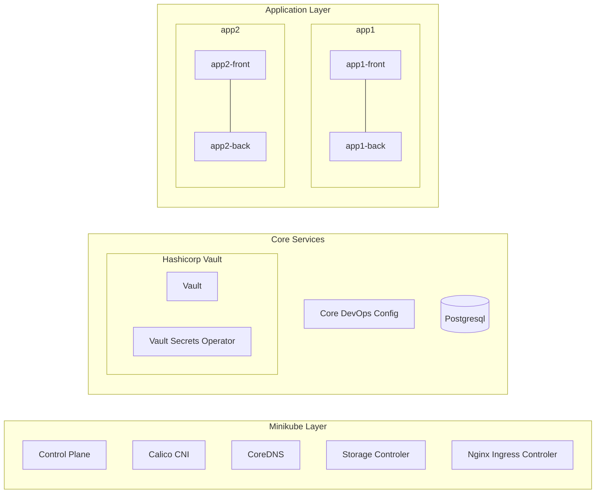

# K8s Deployment (Example)

<a name="table-of-content"></a>
Table of Content:
* [Introduction](#introduction)
* [Local Development Environment](#local-development-environment)
* [Deployment Process and Toolset](#deployment-process-and-toolset)
* [Architecture](#architecture)
* [Application Stack](#application-stack)
* [Secrets Management](#secrets-management)
* [Create local environment](#create-local-environment)
* [TODO](#todo)

## Introduction

This project demonstrate the deployment of a simple frontend-backend application in Kubernetes.

The objectives of this project are to:
* Showcase how to use a local Kubernetes environment for development and testing.
* Introduce tools for deploying a full-stack application and its dependent services to Kubernetes.
* Explore different approaches to managing secrets in a Kubernetes environment.
* Enhance network security by implementing **Network Policies**

[Back to Table of Content](#table-of-content)

## Local Development Environment

A fast and easily configurable local environment is crucial for implementing a rapid development
process with a quick feedback loop. My current setup is based on [Minikube](https://minikube.sigs.k8s.io/) 
using the [Docker driver](https://minikube.sigs.k8s.io/docs/drivers/docker). This approach allows for easy
testing of different configurations, even when working on multiple projects, thanks to **Minikube
profiles**.

To monitor the state of the Kubernetes cluster, I use [k9s](https://k9scli.io/), which provides 
a user-friendly terminal UI. For scripting and automation tasks, I primarily use 
[kubectl](https://kubernetes.io/docs/reference/kubectl/).

For task automation, I use [just](https://just.systems/). Initially, I used [GNU Make](https://www.gnu.org/software/make/),
but it has its own quirks. *just* aiiows me to create a consistent CLI interface that streamlines interactions
with all project-related tools.

The full list of available commands can be accessed by running:
```sh
    $ just
```
All further command examples will include both the *just* version and the original command. The command
definitions can be found in the [justfile](justfile).

List of tools *(The versions in bracklets indicate the ones used by me during development)*:
* docker engine (v27.3.0)
* minikube (v1.34.0) with Kubernetes (v1.31.0)
* kubectl (v1.31.2) 
* just (1.37.0)
* k9s (0.32.6)

[Back to Table of Content](#table-of-content)

## Deployment Process and Toolset

To configure the cluster and deploy all necessary applications, I chose a **push-based approach**. 
This method is easier and faster to run locally, as it doesn't require additional services like 
[ArgoCD](https://argo-cd.readthedocs.io/) or [FluxCD](https://fluxcd.io/) within Kubernetes.

Two main tools in this process are (Helm)[https://helm.sh/] to manage installation of separate application and
[Helmfile](https://helmfile.readthedocs.io/) to manage full stack and environments. I could use Helm alone 
but *Helmfile* allows me to better manage variables (per environment), secrets and installing/updating not 
only full stack but some part's of it. More info about it will be in section [Application Stack](#application-stack)


The two main tools in this process are:
* [Helm](https://helm.sh/) – Manages the installation of individual applications.
* [Helmfile](https://helmfile.readthedocs.io/) – Manages the entire stack and different environments.

While I could use Helm alone, Helmfile provides better control over environment-specific 
variables, secrets, and selective stack deployments (not just full-stack updates). More 
details can be found in the [Application Stack](#application-stack) section.

For secrets manament, I'm using:
* [SOPS](https://github.com/getsops/sops)
* [The GNU Privacy Guard](https://www.gnupg.org/)

More details on secrets management are covered in the [Secrets Management](#secrets-management) section.

List of tools *(The versions in bracklets indicate the ones used by me during development)*:
* helmfile (v0.169.0)
* helm (v3.16.3)
* helm plugins:
  * diff (3.9.13)
  * secrets (4.6.0)
* GnuPG (2.4.5)

[Back to Table of Content](#table-of-content)

## Architecture

The solution is built on a few key assumptions:
1. Kubernetes Cluster Provisioning - the Kubernetes cluster is not created by this solution; 
it is provided externally (in the local environment, this is handled by Minikube).
2. Preinstalled Services - some services inside the cluster are already preinstalled, including:
  * CNI Plugin – Calico
  * CSI Plugin
  * Ingress Controller – Nginx
  * CoreDNS
3. Deployment Responsibilities
  * Deployments within Kubernetes can be handled by different teams, including DevOps, Frontend, and Backend teams.
  * This setup provides only a basic structure for team-based deployments. Currently, namespaces are used to separate applications, but roles and role bindings are not yet implemented.

### Service Layer Breakdown

This solution consists of three layers:
* Kubernetes Control Plane & Core Services – Managed by Minikube.
* Core Configuration & Infrastructure Services – Managed by the DevOps team.
* Application Services – Managed by development teams (Frontend & Backend).



[Back to Table of Content](#table-of-content)

## Application Stack 

The Application Stack includes all releases managed by Helmfile (see [helmfile.yaml](helmfile.yaml)). This encompasses not only the applications that need to be deployed but also:

* Core services that these applications depend on.
* Generic Kubernetes configurations managed by the DevOps team.

This approach ensures that both application-specific and infrastructure-related components are deployed and maintained in a consistent, automated manner.

### Helmfile 


### Services

This section describes the currently installed services and their purposes.

[Back to Table of Content](#table-of-content)

## Secrets Management

[Back to Table of Content](#table-of-content)

## Create local environment

Initial setup

```sh
    $ just create-k8s
    or
    $ minikube start --profile={{profile}} --nodes=3  --cni=calico --addons=csi-hostpath-driver --addons=ingress --kubernetes-version=v1.31.0 --cpus 2 --memory 3072
```

Delete development environment:
```sh
    $ just delete-k8s
    or
    $ minikube delete --profile=vin-development
```

```sh
    helmfile sync
```

[Back to Table of Content](#table-of-content)

## TODO

* [ ] Write documentation
* [ ] Fix persistance storage for Vault (cannot be done with dev)
* [ ] Add separation namespaces egress policies
* [ ] Hardening network policies for Postgresql 
* [x] Add separation network policies for backend, frontend and databases(?) namespaces
* [x] Add whitelist with paths
* [x] Add ingress
* [x] Set Network policies
* [x] Add test for communication with DB
* [x] Fix soap setup and add init for gpg key

[Back to Table of Content](#table-of-content)

